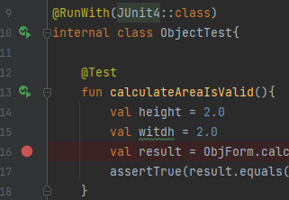
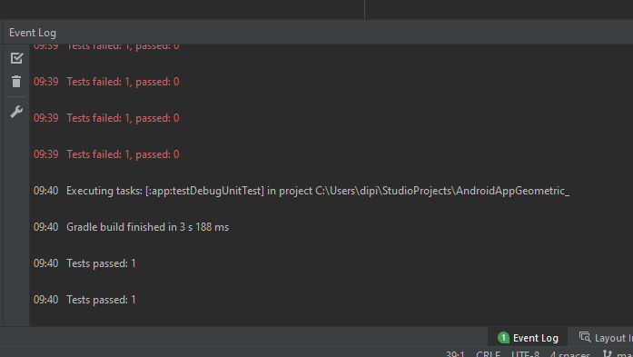

# Tutorial de Teste Unitário no Android

## Descrição

Para criar um teste unitário com JUnit no Android você só precia criar uma classe de testes baseada na sua classe de negócio (ou criar ou teste antes da classe com TDD).

## Classe de negócio de exemplo

Nossa função de exemplo realiza um cálculo de área multiplicando base vezes altura.

```kotlin
    fun CalculateArea(base:Double, altura: Double): Double{
        return base * height;
    }
```

## Criando o arquivo de teste

Ao clicar com o botão o botão direito sobre o nome da função e selecione "Generate..." ou digite *alt+insert*.


No menu Generate, selecione *Test...*. Dessa forma uma janela abrirá com as opções de geração de modelos de métodos de teste.


Automaticamente será selecionado o JUnit5. Em *Class name* no nome da classe defina como será chamada a classe de teste. O *Destination package* deve ser o mesmo da classe de negócio.

Em *Generate test methods* for selecione o método que deseja testar.


Na janela Choose Destination Directory você define a pasta onde será salvo a classe de teste. Em seguida a classe de teste será gerado pelo Android Studio.

```Kotlin
internal class GeoFormTest {

    @Test
    fun calculateArea() {
    }
}
```

Caso não tenha as referência ao JUnit incluida utilizando a *lâmpada vermelha*.


## Classes e funções de teste

As *funções* de teste devem ter o atributo **@Test** e a *classe* precisa apontar para qual ferramenta de testes deve ser usada com ao atributo **@RunWith**.

```Kotlin

import org.junit.runner.RunWith
import org.junit.runners.JUnit4

@RunWith(JUnit4::class)
internal class ObjectTest{
   @Test
    fun calculateAreaIsValid(){
    }   
}
```

No método de teste você pode declarar parâmetros e salvar o retorno do seu método em uma variável. Este resultado você compara com o resultado esperado utilizando assertTrue()

```Kotlin
    @Test
    fun calculateAreaIsValid(){
        val height = 2.0
        val witdh = 2.0
        val result = ObjForm.calculateArea(height,witdh)
        assertTrue(result.equals(4.0))
    }
```    


## Rodando o teste

Para rodar o teste clique no simobolo play verde ao lado da declaração do método de teste. Você pode executar todos os teste da classe clicando no botão da classe ou executar testes inidividualmente na declaração de cada uma das funções de teste.




## Resultado do teste

Veja o resultado o teste no painel *Event Log*:



